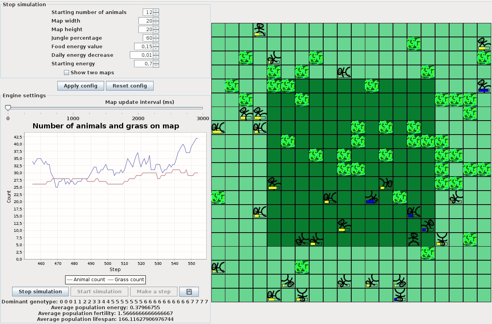
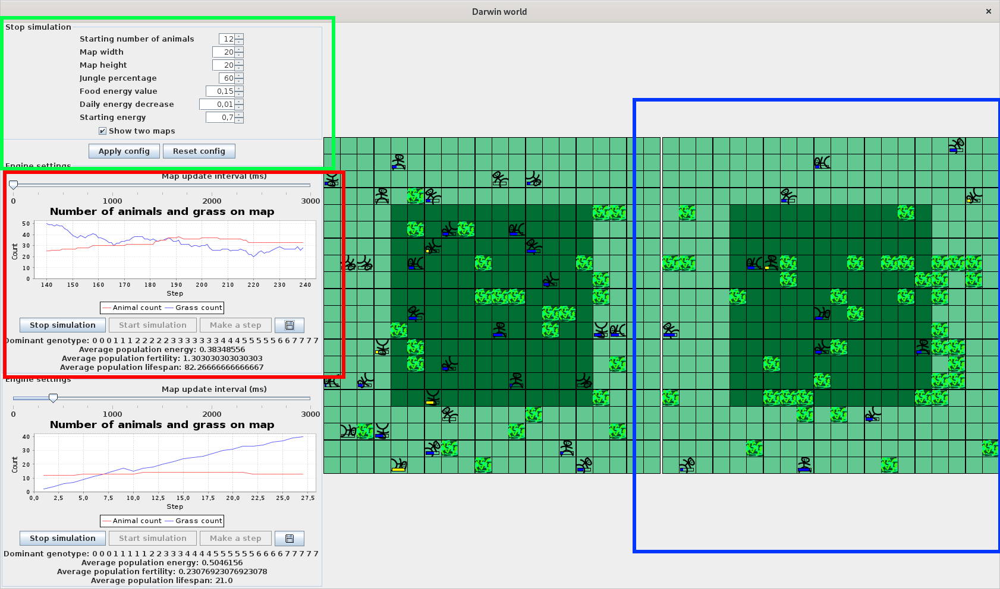
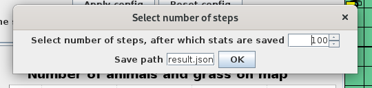
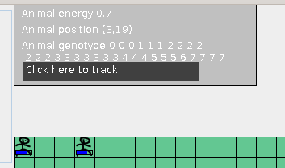

DARWIN WORLD
---

##### What is Darwin World?
Darwin World Is a simulation of evolution with the simplest rules possible - best fed animals breed when they meet and 
produce offspring, that inherits their genes.

Genes inheritance works like this:  
 - Split the genotype of animal in three parts (select two positions where crossing will happen)
 - Select two parts from one parent,   and one part from the other parent
 - Modify the genotype so at least one occurrence of given gene is present
 
##### So how does it all work?
Animals roam the map, when they land on a grass field, it is eaten,
and the animal gains energy (the food energy parameter).  
When two animals meet, and they have enough energy, they
breed, producing an offspring.   
If an animal has no more energy, It dies.  
There are two locations in the simulation world - the Jungle and the remaining squares.   
They both work the same way, and one grass field is spawned in each 
of the squares per day. 

### The user interface  
    
The user interface is split into three main parts:
 - The setup panel, green border
 - The engine panel, red border
 - The map panel, blue border
 Each of those panels provides different functionality.
 
 ###### Setup panel
 
 Use the setup panel to setup initial engine options, like how much energy
 is awarded to the animal after eating grass, or the dimension of the
 map.  
 You can also choose to create two maps with the same config
 to compare the same starting parameters with different random scenarios.
 
 ###### Engine Panel
 
 The engine panel provides information about the current situation on the map
 along with some statistics. You can set the map update interval
 here and control the engine state. 
 
 You can press the floppy drive icon in the engine panel to save engine statistics
 after given number of steps:
 
 This can be done while the engine is running, and stats will be saved 
 to the result file after selected number of steps pass - the steps
 start counting after the "OK" button is pressed.
 
 Example result of stats tracking looks like this:
 >{ 
  	&nbsp;&nbsp;&nbsp;&nbsp;"noEpochs":100.0, 
  	&nbsp;&nbsp;&nbsp;&nbsp;"avgChildren":1.7476808523081717, 
  	&nbsp;&nbsp;&nbsp;&nbsp;"avgLifespan":147.2264058731753, 
  	&nbsp;&nbsp;&nbsp;&nbsp;"avgGrass":13.82, 
  	&nbsp;&nbsp;&nbsp;&nbsp;"avgAnimals":26.88, 
  	&nbsp;&nbsp;&nbsp;&nbsp;"avgEnergy":0.41769763380289077 
  } 
>

If two engines are displayed, both can be traced at once. Also, it is possible
to set up multiple stat tracers for one engine.

 
 ###### Map panel
 
 The map panel presents the current state of the simulation.
 The blue bar shows the animal's energy percentage, and if 
 the bar turns yellow, this animal has the dominant genotype.
 
 Jungle area is marked with a slightly darker color.
 
 
#### Animal tracing

You can track the selected animal by clicking it on the map. If you do so,
a window will appear displaying animal information.
  
These stats are updated while the engine is running.
You can also press "Click here to track" to track the animal more
precisely - how many children it has born and how many descendants it has after selected numebr
of steps. If the animal is dead, the epoch of death will be dispalyed as well.

After enough steps pass, a popup will appear with the requested information.
Multiple animals can be traced at once, but a single animal can only have
one tracer set up at a time.

#### Default starting parameters

If You run the simulation application often it might be 
painful to set up the same way every time - the default configuration
is saved in parameters.json file and can be changed (but each value
must still be in range of valid values). 

##Have fun!
This should be it - have fun experimenting with the simulation!